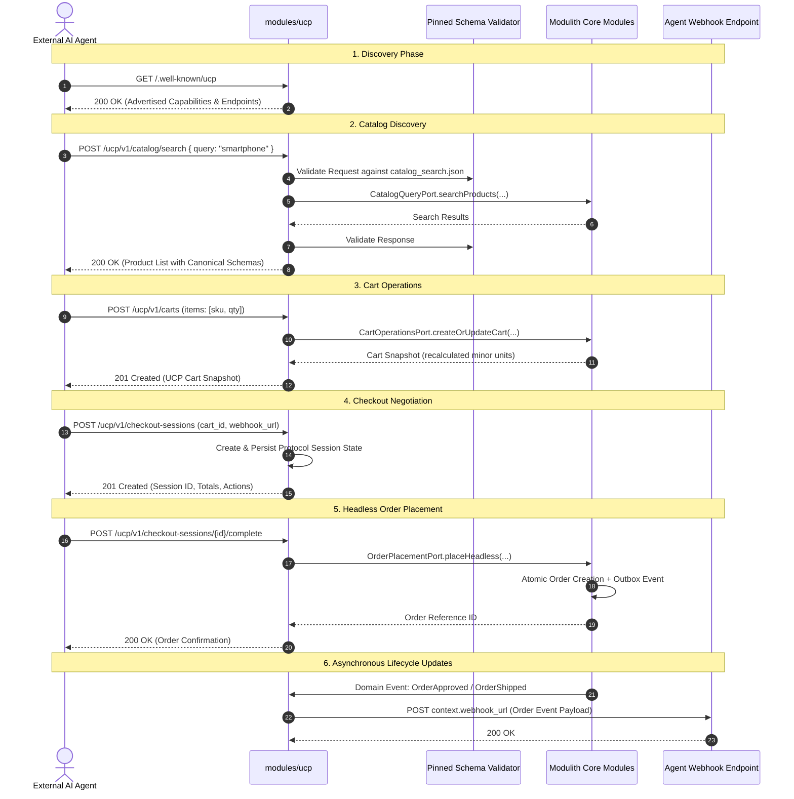

# Universal Commerce Protocol (UCP) Integration & Flow Guide

## 1. Overview & Architectural Role

The **Universal Commerce Protocol (UCP)** module (`modules/ucp`) acts as an **interoperability protocol adapter** inside the Aionn Modular Monolith. It enables external AI agents, autonomous buyers, and remote commerce platforms to interact with Aionn's commerce engine without bypassing domain rules.

```
       [ External AI Agent / UCP Client ]
                       │  HTTPS + REST (UCP 2026-08-25)
                       ▼
┌─────────────────────────────────────────────────────────┐
│                     modules/ucp                         │
│  ┌───────────────────────────────────────────────────┐  │
│  │ UcpHeaderFilter (MDC, X-Request-Id, UCP-Agent)    │  │
│  └─────────────────────────┬─────────────────────────┘  │
│                            ▼                            │
│  ┌───────────────────────────────────────────────────┐  │
│  │ REST Controllers (Discovery, Cart, Checkout, etc) │  │
│  └─────────────────────────┬─────────────────────────┘  │
│                            ▼                            │
│  ┌───────────────────────────────────────────────────┐  │
│  │ Application Services & Schema Validation Pipeline │  │
│  │ (Pinned JSON Schema 2026-08-25, Offline Resolver) │  │
│  └─────────────────────────┬─────────────────────────┘  │
└────────────────────────────┼────────────────────────────┘
                             │ In-Process Java Port Calls
                             ▼
┌─────────────────────────────────────────────────────────┐
│                    shared-kernel                        │
│  (CartOperationsPort, OrderPlacementPort, CatalogQuery) │
└────────────┬───────────────┬────────────────┬───────────┘
             ▼               ▼                ▼
     ┌───────────────┐┌──────────────┐┌───────────────┐
     │modules/catalog││modules/order ││modules/ident..│
     └───────────────┘└──────────────┘└───────────────┘
```

---

## 2. End-to-End Agentic Commerce Flows

Below is the complete purchasing lifecycle through UCP:



---

## 3. Detailed Step-by-Step Interactions

### Flow 1: Business Profile Discovery

- **Endpoint**: `GET /.well-known/ucp`
- **Controller**: [`DiscoveryController`](file:///d:/mix-of-ucp-ecommerce/aionn-modulith-backend/modules/ucp/src/main/java/com/aionn/ucp/adapter/rest/controller/DiscoveryController.java)
- **Application Service**: `UcpProfileApplicationService`
- **Mechanism**:
  1. Reads business identity, contact metadata, and active capability flags from `UcpProperties`.
  2. Dynamically constructs the root discovery response adhering to UCP protocol `2026-08-25`.
  3. Advertises all 6 implemented core capabilities (`cart`, `checkout`, `catalog.lookup`, `catalog.search`, `identity_linking`, `order`).
  4. Omits or marks unadvertised optional extensions (`advertised=false`).

### Flow 2: Identity Linking

- **Endpoints**:
  - `POST /ucp/v1/identity/links`: Establish connection between an external platform subject and internal Aionn customer.
  - `GET /ucp/v1/identity/links/{platformId}/{platformSubject}`: Query link status.
  - `DELETE /ucp/v1/identity/links/{platformId}/{platformSubject}`: Revoke link.
- **Controller**: [`UcpIdentityController`](file:///d:/mix-of-ucp-ecommerce/aionn-modulith-backend/modules/ucp/src/main/java/com/aionn/ucp/adapter/rest/controller/UcpIdentityController.java)
- **Port**: `UcpIdentityLinkPort` (backed by [`InMemoryUcpIdentityLinkAdapter`](file:///d:/mix-of-ucp-ecommerce/aionn-modulith-backend/modules/ucp/src/main/java/com/aionn/ucp/infrastructure/adapter/InMemoryUcpIdentityLinkAdapter.java))
- **Security**: IDOR protection ensures callers can only manipulate links authorized for their authenticated subject context.

### Flow 3: Catalog Search & Lookup

- **Endpoints**:
  - `POST /ucp/v1/catalog/search`: Multi-criteria search with keywords, category, and price range.
  - `POST /ucp/v1/catalog/lookup`: Batch lookup of items by SKUs/IDs.
  - `POST /ucp/v1/catalog/product`: Detailed view of a single product.
- **Controller**: [`UcpCatalogController`](file:///d:/mix-of-ucp-ecommerce/aionn-modulith-backend/modules/ucp/src/main/java/com/aionn/ucp/adapter/rest/controller/UcpCatalogController.java)
- **Port**: `CatalogQueryPort` in `shared-kernel`.
- **Validation**: Strict verification against `schemas/shopping/catalog_search.json` and `catalog_lookup.json`. Prices are converted into minor units (cents).

### Flow 4: Cart Lifecycle

- **Endpoints**:
  - `POST /ucp/v1/carts`: Create cart with line items.
  - `GET /ucp/v1/carts/{id}`: Retrieve cart status and line items.
  - `PUT /ucp/v1/carts/{id}`: Replace/update line items.
  - `POST /ucp/v1/carts/{id}/cancel`: Clear/abandon cart.
- **Controller**: [`UcpCartController`](file:///d:/mix-of-ucp-ecommerce/aionn-modulith-backend/modules/ucp/src/main/java/com/aionn/ucp/adapter/rest/controller/UcpCartController.java)
- **Port**: `CartOperationsPort` implemented by `modules/ordering`.
- **Integrity**: Pessimistic/optimistic locking prevents race conditions on item quantities. Mixed-currency carts are rejected fail-closed.

### Flow 5: Checkout Negotiation & Headless Placement

- **Endpoints**:
  - `POST /ucp/v1/checkout-sessions`: Initialize checkout session from a Cart ID or explicit items.
  - `GET /ucp/v1/checkout-sessions/{id}`: Query session state, fees, and required actions.
  - `PUT /ucp/v1/checkout-sessions/{id}`: Update shipping address, email, or discounts.
  - `POST /ucp/v1/checkout-sessions/{id}/complete`: Finalize checkout.
  - `POST /ucp/v1/checkout-sessions/{id}/cancel`: Cancel session.
- **Controller**: [`UcpCheckoutController`](file:///d:/mix-of-ucp-ecommerce/aionn-modulith-backend/modules/ucp/src/main/java/com/aionn/ucp/adapter/rest/controller/UcpCheckoutController.java)
- **Session Store**: `UcpCheckoutSessionPort` tracks protocol lifecycle states (`PENDING`, `READY_FOR_COMPLETION`, `COMPLETED`, `CANCELLED`) with TTL eviction.
- **Order Placement**: Completion delegates directly to `OrderPlacementPort.placeHeadless(...)`. This creates the real order in `modules/ordering`, initiates stock reservation, and triggers the Transactional Outbox event.

### Flow 6: Order Snapshots & Webhook Push

- **Endpoints**:
  - Inbound Query: `GET /ucp/v1/orders/{id}` retrieves order status conforming to `schemas/shopping/order.json`.
  - Outbound Webhook: Dispatched to client's `context.webhook_url` when internal order lifecycle events occur.
- **Listener & Dispatcher**:
  - [`UcpOrderEventListener`](file:///d:/mix-of-ucp-ecommerce/aionn-modulith-backend/modules/ucp/src/main/java/com/aionn/ucp/infrastructure/webhook/UcpOrderEventListener.java): Spring `@TransactionalEventListener(phase = AFTER_COMMIT)` listens to domain events (`OrderPlaced`, `OrderApproved`, `OrderShipped`, `OrderCompleted`, `OrderCancelled`).
  - [`RestClientUcpWebhookDispatcher`](file:///d:/mix-of-ucp-ecommerce/aionn-modulith-backend/modules/ucp/src/main/java/com/aionn/ucp/infrastructure/webhook/RestClientUcpWebhookDispatcher.java): Dispatches HTTP POST webhooks with SSRF protection (rejecting private/internal IP ranges) and timeout enforcement.

---

## 4. Cross-Cutting Technical Guarantees

### Strict Schema Validation Pipeline

All incoming payloads and outgoing responses are validated against canonical UCP schemas (`modules/ucp/src/main/resources/ucp/2026-08-25/`):

- **Authority Binding**: Restricts `$ref` schema references to canonical `https://ucp.dev/schemas/...`.
- **SSRF & Offline Resolution**: Completely avoids outbound network calls during schema validation; references are resolved against locally pinned classpath assets.
- **Path Traversal Protection**: Rejects schema paths containing `..` or external protocol references.

### Protocol Error Handling (`UcpControllerAdvice`)

Internal system exceptions are never exposed to external clients. All errors are mapped to canonical UCP error envelopes (`schemas/common/error_response.json`):

```json
{
  "ucp": {
    "version": "2026-08-25"
  },
  "status": "error",
  "messages": [
    {
      "code": "ITEM_OUT_OF_STOCK",
      "message": "Requested item quantity exceeds available stock",
      "path": "/items/0/quantity",
      "recoverable": true
    }
  ],
  "correlation_id": "c61b0a88-d635-47e8-b648-5c1cfdcaec57"
}
```

### Observability & Metrics

- **Micrometer Metrics**:
  - `ucp.requests.total`: Counter tagged by `capability`, `operation`, `status`.
  - `ucp.requests.duration`: Timer measuring protocol latency.
  - `ucp.webhooks.total`: Counter tracking webhook delivery attempts and outcomes.
- **Correlation & MDC**: `UcpHeaderFilter` automatically sets `X-Request-Id` into SLF4J MDC, propagating correlation through the entire modulith log stream.
- **OpenAPI / Swagger**: UCP REST APIs are exposed under the `"UCP"` documentation group at `/swagger-ui.html`.
