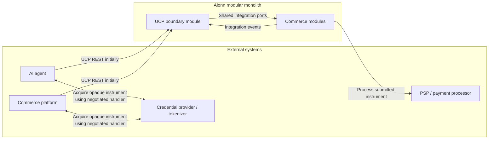
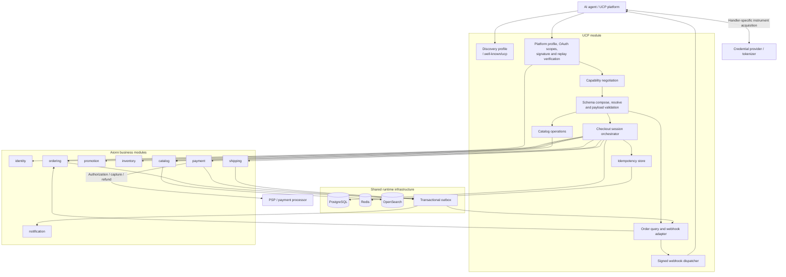
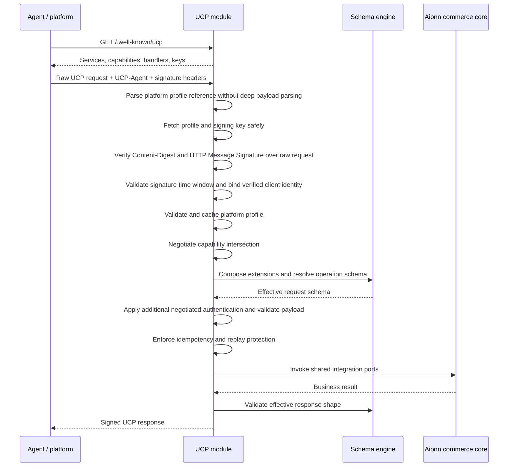
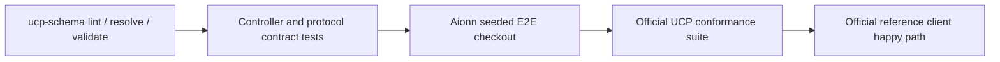
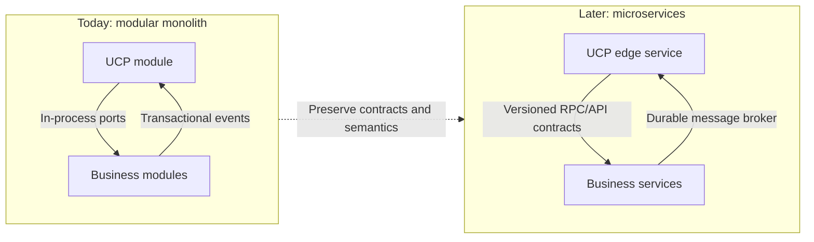

# UCP Architecture for Aionn Modulith

## 1. Architectural position

Universal Commerce Protocol (UCP) is an external commerce protocol, not an
Aionn business domain and not necessarily an independently deployed service.
In the current modular monolith, UCP should be implemented as a boundary module
between external platforms or agents and Aionn's existing commerce modules.



The UCP module translates and orchestrates protocol operations. It must not
duplicate ownership of products, inventory, orders, payments, shipments,
promotions, or identities.

Aionn remains the Merchant of Record and the authority for product availability,
price, checkout state, order state, fulfillment, payment outcomes, and
post-purchase operations. UCP standardizes how external platforms interact with
those decisions; it does not transfer business-rule ownership to the agent.

A payment handler is a specification that connects platform, business, and any
handler-specific participant; it is not one universal Aionn-to-PSP API. In the
common three-phase flow, Aionn advertises handler configuration, the platform
acquires an opaque payment instrument from a credential provider or tokenizer,
then submits it to Aionn. The `payment` module remains responsible for processing
that instrument through Aionn's backend PSP integration.

## 2. Proposed modulith structure

```text
aionn-modulith-backend/
  app/                         Spring Boot composition root
  shared-kernel/               Cross-module contracts and primitives
  modules/
    identity/                  Accounts, OAuth, addresses, consent
    catalog/                   Products, variants, merchants, search
    inventory/                 Stock and reservations
    ordering/                  Cart, order, return
    payment/                   Payment, refund, settlement, payout
    shipping/                  Rates, fulfillment, shipment
    promotion/                 Voucher, discount, campaign
    notification/              Customer and merchant notifications
    chat/                      Conversations and messages
    ucp/                       UCP discovery, negotiation and protocol adapter
```

The proposed `ucp` module follows the same ports-and-adapters rules as every
other module:

```text
modules/ucp/src/main/java/com/aionn/ucp/
  domain/
    model/                     Checkout session and delivery state
    valueobject/               Negotiated capabilities and platform identity
    exception/
  application/
    service/                   Negotiation and UCP flow orchestration
    usecase/                   Thin input-port implementations
    port/in/                   UCP operations
    port/out/                  Schema, idempotency and webhook abstractions
    dto/                       Transport-neutral application data
  adapter/
    rest/                      REST transport and /.well-known/ucp
    mcp/                       Optional later transport over the same use cases
    event/                     Receives internal order lifecycle events
  infrastructure/
    schema/                    Compose, resolve and validate UCP schemas
    persistence/               Sessions and protocol delivery state
    security/                  Profile fetching and HTTP message signatures
    webhook/                   Signed order-event delivery
    config/                    UCP profile and capability configuration
```

## 3. Runtime component view



Arrows from UCP to business modules represent shared-kernel integration ports,
not imports of another module's private classes. Arrows back to UCP represent
durable integration events where delivery must survive process restarts.

## 4. Discovery and request processing



Profile and schema fetching must enforce HTTPS, namespace authority binding,
redirect policy, response-size/time limits, and protections against SSRF, DNS
rebinding, private addresses, and cloud metadata endpoints.

The UCP HTTP interface is server-to-server. Browser CORS is not part of this
transport contract. Before discovery is advertised, the implementation must add
an exact unauthenticated `GET /.well-known/ucp` matcher and a real-filter-chain
integration test; the endpoint and matcher do not exist in the current codebase.

## 5. Checkout-to-order flow

```mermaid
sequenceDiagram
    participant P as Agent / platform
    participant U as UCP module
    participant C as Catalog
    participant R as Promotion
    participant S as Shipping
    participant O as Ordering
    participant Pay as Payment
    participant CP as Credential provider
    participant PSP as Backend PSP
    participant E as Outbox

    P->>U: Create checkout + Idempotency-Key
    U->>C: Resolve products, variants and current prices
    U->>R: Evaluate discounts and vouchers
    U->>S: Quote fulfillment options
    U-->>P: Checkout with totals, options and messages

    P->>U: Update checkout selections
    U->>U: Recalculate authoritative checkout snapshot
    U-->>P: Updated checkout

    P->>CP: Acquire opaque instrument using negotiated handler
    CP-->>P: Bound token / credential
    P->>U: Complete checkout + opaque instrument
    U->>Pay: Exchange instrument at payment boundary
    Pay->>PSP: Resolve instrument to internal paymentMethodId
    PSP-->>Pay: Non-sensitive payment reference
    Pay-->>U: paymentMethodId
    U->>O: Place headless order with paymentMethodId and stable paymentAttemptId
    O->>Pay: Authorize(paymentMethodId, paymentAttemptId)
    Pay->>PSP: Authorize idempotently using paymentAttemptId
    alt Completion finishes synchronously
        O->>E: OrderPlaced event in same transaction
        U-->>P: Completed checkout and order confirmation
    else Completion is accepted asynchronously
        U-->>P: complete_in_progress checkout without order
        E-->>U: Durable order/payment lifecycle event
        U->>U: Transition checkout to completed with order reference
        U-->>P: Signed webhook; subsequent GET returns completed checkout
    end

    E-->>U: Order/payment/shipment lifecycle events
    U-->>P: Signed, retryable and idempotent order webhook
```

The diagram shows responsibility, not a single database transaction. The
existing `OrderPlacementPort` delegates to ordering's headless placement flow,
which already coordinates catalog pricing, stock, promotion, payment, and order
state. UCP must not independently reserve stock or authorize payment and then
also invoke that orchestration, because doing so would duplicate side effects.
The exact ordering must follow internal invariants and provider semantics.
Non-rollbackable provider calls must not occur inside database transactions;
failures require explicit compensation, not an assumed distributed transaction.
A stable payment-attempt ID must be persisted before authorization and passed to
the provider as its idempotency reference. An interrupted or timed-out attempt
remains `unknown` until provider reconciliation establishes a definitive result;
neither the payment attempt nor its idempotency record may be deleted or retried
while the outcome is unknown.

The current draft also permits `complete_in_progress` before the terminal
`completed` status. A completed checkout includes the order; an in-progress
checkout does not. The UCP session must therefore support both synchronous and
accepted/asynchronous completion rather than assuming every call finishes the
order inline.

## 6. Ownership boundaries

| Concern | Owning module | UCP responsibility |
| --- | --- | --- |
| Product and variant truth | `catalog` | Map search, lookup and product views |
| Cart and order truth | `ordering` | Translate checkout completion and order reads |
| Available and reserved stock | `inventory` | Request reservation/commit/release |
| Voucher and discount rules | `promotion` | Expose negotiated discount extension |
| Shipment and rate truth | `shipping` | Expose fulfillment choices and lifecycle |
| Payment and refund truth | `payment` | Map submitted handler instruments into internal payment commands |
| User, address and OAuth consent | `identity` | Implement identity-linking protocol boundary |
| Customer communications | `notification` | Trigger through internal events |
| Negotiated capabilities | `ucp` | Own negotiation result and protocol context |
| UCP checkout representation | `ucp` | Own protocol session and immutable snapshots |
| UCP idempotency and webhook delivery | `ucp` | Own protocol-specific delivery guarantees |

UCP checkout state is not the authoritative Aionn order. Before completion it
is a protocol session; after completion it references the authoritative order
owned by `ordering`.

## 7. Persistence and reliability

The UCP module may add tables such as:

```text
ucp_checkout_sessions
ucp_checkout_snapshots
ucp_idempotency_records
ucp_webhook_deliveries
```

Persist only state required for correctness, auditing, retries, or protocol
reconstruction. Product, stock, payment, and order state remains in its owning
module.

Opaque payment instruments are exchanged at the payment boundary and must never
be written to checkout sessions or snapshots, outbox records, logs, traces, or
integration events. UCP persistence retains only the resulting non-sensitive
`paymentMethodId` and stable `paymentAttemptId` references.

Fetched platform profiles are cache data, not business records. They should use
a bounded cache such as Redis with HTTP cache semantics, a minimum TTL floor,
response-size limits, and controlled refresh behavior rather than an unbounded
source-of-truth table.

State-changing UCP operations must support an idempotency key with at least 128
bits of entropy. The key scope is per client and operation type. Records are
retained for at least 24 hours, with 48 hours recommended. Reusing a key with the
same request returns the cached response without new side effects; reusing it
with a different payload produces the protocol-defined mismatch error. If the
idempotency store is unavailable, mutation requests fail closed with HTTP 503.

Idempotency and replay records must be keyed by the cryptographically verified
client identity, operation type, and idempotency key. Unverified `UCP-Agent`
values, remote addresses, and an `anonymous` principal must not define this
scope. Every UCP mutation must use a dedicated boundary that requires a nonblank
key, validates at least 128 bits of entropy, retains completed responses for at
least 24 hours, and converts both record-store and response-save failures into
HTTP 503. The current generic `IdempotencyInterceptor` does not yet satisfy this
UCP contract and must not be reused unchanged when the UCP module is implemented.

HTTP signatures authenticate the caller and protect message integrity;
idempotency provides safe retry and replay protection. The idempotency key must
be among the signed components when signatures are used. Webhooks must be
signed. Other request authentication mechanisms such as OAuth, API keys, or
mTLS may be used where the negotiated integration requires them.

Order webhooks use durable outbox delivery, stable event identifiers, bounded
retries, dead-letter handling, signatures, and idempotent consumption.

## 8. Delivery stages


Each stage should be testable with generated or official UCP payloads before
the next capability is advertised in the production profile. A capability must
not be advertised merely because its controller exists.

## 9. Version and schema policy

UCP uses date-based protocol releases. Aionn must pin an explicitly supported
release in its profile, generated DTOs or schemas, conformance configuration,
and compatibility tests. Production must not advertise `draft`, fetch mutable
schemas from a branch, or silently follow the `latest` alias.

At the time of this review, the upstream repository's `main` documentation is a
`draft`, while its documentation identifies `2026-04-08` as the stable release.
New material on `main`, including later payment and checkout changes, is useful
for forward planning but is not automatically part of Aionn's first production
contract. A release upgrade is an explicit compatibility project.

There is currently no official Java SDK in the UCP organization; the official
SDKs are Python and JavaScript, while `ucp-schema` is a Rust CLI/library. Before
implementation, Aionn needs a short technical spike to select one of these
schema strategies:

1. Materialize the pinned operation schemas during the build and validate them
   at runtime with a compatible Java JSON Schema implementation.
2. Integrate a supported schema-resolution component around `ucp-schema`.
3. Implement the UCP annotations and composition rules in Java, backed by the
   upstream fixtures and conformance suite.

Whichever option is selected, the canonical upstream schemas remain the source
of truth. Handwritten Java DTO validation alone is insufficient.

## 10. Verification strategy



The official conformance suite can target any merchant server. Aionn should
provide deterministic fixture data for products, stock, discounts, shipping,
and buyers, plus a test-only simulation control protected by a secret if the
suite needs to advance payment or order states. Production business endpoints
must not expose simulation controls.

The acceptance gate for an advertised capability is:

- the pinned profile and all payload examples validate against resolved schemas;
- negative protocol, signature, idempotency, and authorization cases pass;
- the Aionn E2E test proves real module integration and compensation behavior;
- the applicable official conformance tests pass against the running app;
- at least one official reference client completes the supported happy path.

Official implementation references:

- [UCP specification](https://ucp.dev/2026-04-08/specification/overview/)
- [UCP source repository](https://github.com/Universal-Commerce-Protocol/ucp)
- [Schema composition and validation tool](https://github.com/Universal-Commerce-Protocol/ucp-schema)
- [Official conformance suite](https://github.com/Universal-Commerce-Protocol/conformance)
- [Official REST and A2A samples](https://github.com/Universal-Commerce-Protocol/samples)
- [Official Python SDK](https://github.com/Universal-Commerce-Protocol/python-sdk)
- [Official JavaScript SDK](https://github.com/Universal-Commerce-Protocol/js-sdk)
- [Google's UCP architecture walkthrough](https://developers.googleblog.com/under-the-hood-universal-commerce-protocol-ucp/)

## 11. Future extraction to microservices

The module boundary is also the future extraction seam:



The future migration should change transport and deployment boundaries, not
commerce semantics. Keeping UCP behind shared integration ports now avoids
coupling controllers to private domain models and makes later extraction much
safer.
