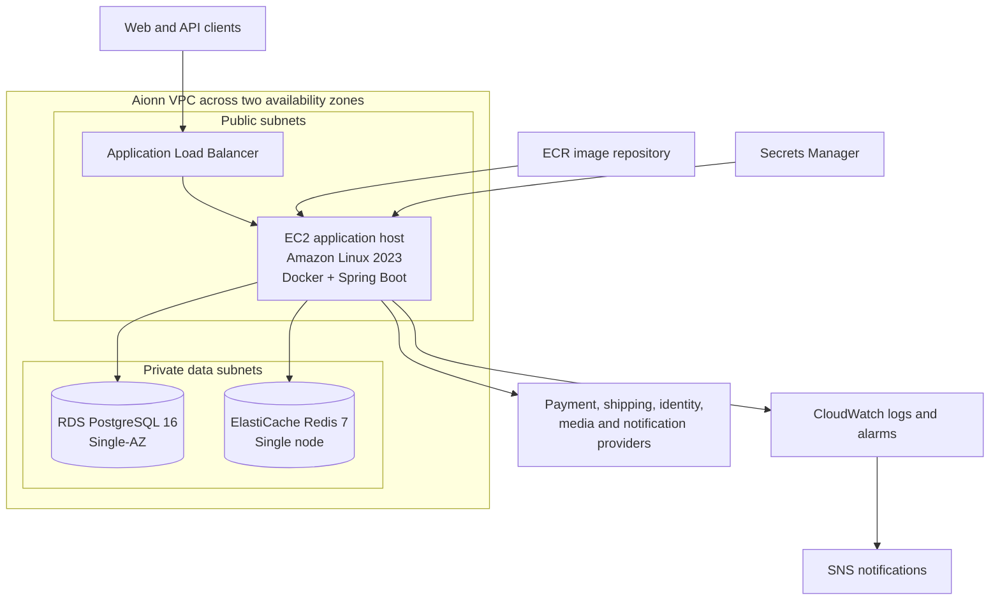

# AWS Infrastructure Architecture

This document describes the AWS infrastructure for the Aionn modular monolith backend, including its network boundaries, runtime lifecycle, data services, security controls, and operational responsibilities.

## Architecture



## Components

### Network

The infrastructure spans two availability zones. Public subnets contain the internet-facing load balancer and the application host. Private subnets contain PostgreSQL and Redis, neither of which is publicly accessible.

Security groups enforce the following paths:

- Internet traffic reaches only the load balancer on ports 80 and 443.
- The application host accepts port 8080 only from the load balancer security group.
- PostgreSQL accepts port 5432 only from the application security group.
- Redis accepts port 6379 only from the application security group.
- The application host uses the Internet Gateway for outbound provider integrations.

### Application runtime

The backend runs as a Docker container on an Amazon Linux 2023 EC2 instance. The instance is initialized through `templates/ec2-user-data.sh.tftpl`.

During initialization, the host:

1. Installs and enables Docker.
2. Retrieves runtime configuration from Secrets Manager.
3. Authenticates to ECR and pulls the configured immutable image.
4. Starts the Spring Boot container on port 8080.
5. Mounts a writable temporary filesystem while keeping the container root filesystem read-only.
6. Sends container logs to CloudWatch through the Docker `awslogs` driver.

The instance is managed through AWS Systems Manager Session Manager. The infrastructure does not create an SSH key or expose port 22.

### Traffic management

The Application Load Balancer terminates client connections and forwards healthy traffic to the EC2 instance. Its target group checks:

```text
/actuator/health/readiness
```

An ACM certificate can enable HTTPS. When a certificate is configured, the HTTP listener redirects requests to HTTPS.

### PostgreSQL

RDS PostgreSQL is the authoritative data store. It is deployed in private subnets with encrypted storage, automated backups, PostgreSQL logs exported to CloudWatch, and Flyway migrations executed by the application during startup.

The current topology uses a Single-AZ database. Backup restoration and migration compatibility must be rehearsed before treating the environment as production-ready.

### Redis

ElastiCache Redis supports rate limiting, idempotency, authentication challenges, short-lived tokens, and cache workloads. It is deployed privately with encryption at rest, encryption in transit, and an authentication token.

The application enables Redis TLS through Spring Boot runtime configuration.

### Images and secrets

ECR stores immutable backend images and removes older images through a lifecycle policy. Releases should reference an image digest rather than a mutable tag.

Secrets Manager stores database, Redis, identity, payment, shipping, media, and notification credentials. The EC2 role can read only the runtime secret used by the backend. Secret values are not embedded in EC2 user data.

Terraform state contains generated credential values and must be treated as sensitive. Before shared or automated Terraform execution, state storage must be encrypted, access-controlled, versioned, and locked.

### Observability

CloudWatch receives application logs and infrastructure metrics. Initial alarms cover:

- unhealthy load-balancer targets;
- sustained EC2 CPU utilization;
- low RDS storage.

SNS optionally delivers alarm notifications by email. Application-level dashboards and alerts for checkout, payment, inventory, outbox processing, compensation, and provider failures remain follow-up work.

## Repository layout

| File | Responsibility |
| --- | --- |
| `versions.tf` | Terraform and provider version constraints |
| `variables.tf` | Infrastructure inputs and validation |
| `locals.tf` | Naming, tags and runtime environment mapping |
| `network.tf` | VPC, subnets, routes and security groups |
| `data.tf` | PostgreSQL and Redis resources |
| `secrets.tf` | Runtime secret and generated data credentials |
| `iam.tf` | EC2 permissions for ECR, Secrets Manager, CloudWatch and Session Manager |
| `runtime.tf` | ECR, load balancer and EC2 application host |
| `templates/ec2-user-data.sh.tftpl` | EC2 bootstrap and container startup |
| `observability.tf` | CloudWatch alarms and SNS notification subscription |
| `outputs.tf` | Operator-facing endpoints and identifiers |

## Current limitations

- The application tier contains one EC2 instance and has no automatic replacement or scaling group.
- PostgreSQL is Single-AZ.
- Redis contains one cache node.
- Catalog search uses the in-process adapter instead of OpenSearch.
- Database migration runs as part of application startup rather than as a dedicated deployment task.
- DNS records, deployment automation, rollback orchestration and remote Terraform state are not yet defined.

These constraints are acceptable for the initial environment but must be revisited before production launch.

## Evolution path

The infrastructure can be extended without changing application boundaries:

1. Place application instances in private subnets and introduce controlled outbound connectivity.
2. Replace the standalone EC2 instance with an Auto Scaling Group or a managed container runtime.
3. Enable Multi-AZ PostgreSQL and Redis failover.
4. Add DNS, certificate lifecycle and deployment automation.
5. Separate migration execution from application startup.
6. Add application metrics, traces, dashboards and business-impact alerts.
7. Rehearse backup restoration, instance failure and release rollback.